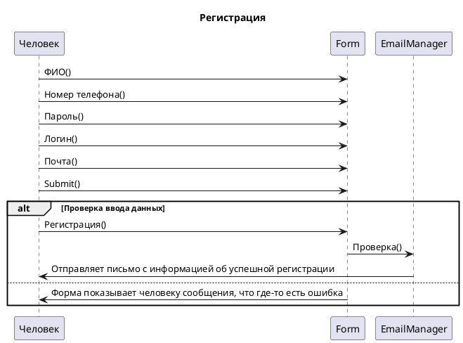
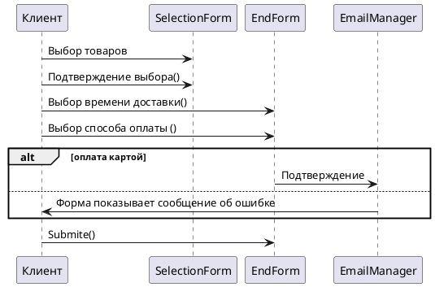

# **Диаграммы:**

## Диаграммы последовательностей

### ***1-Регистрация***



### 2-Создание плана подписок



## Диаграммы состояний

### 1-Создание Подписки

```plantuml
[*] --> Создание_Пподписки 
Создание_Пподписки --> Выбор_Продукции: .SetStatus("Выбор_Продукции")
Создание_Пподписки --> Отмена: .

Выбор_Продукции--> Способ_Оплаты: .SetStatus("Выбор способа оплаты")
Выбор_Продукции--> Отмена: .

Способ_Оплаты--> Выбор_Времени: .SetStatus("Выбор времени")
Способ_Оплаты--> Отмена: [карты не существует]

Выбор_Времени--> Отмена: [ошибка в выборе даты]
Выбор_Времени--> Выбор_Места: .SetStatus("Выбор места доставки")

Выбор_Места--> Создано: .SetStatus("Создано")
Выбор_Места--> Отмена: [Адрес не существует]

Отмена --> [*]
Создано --> [*]
```

## Диаграмма активности

### 1-Регистрация клиента

```plantuml
(*) --> "Нажать на кнопку регистрации пользователя" 
--> ===START===
===START=== --> "Ввод ФИО"
===START=== --> "Ввод номера телефона"
===START=== --> "Ввод емейла"
===START=== --> "Ввод логина"
===START=== --> "Ввод пароля"
"Ввод ФИО" --> ===END===
"Ввод номера телефона" --> ===END===
"Ввод емейла" --> ===END===
"Ввод логина" --> ===END===
"Ввод пароля" --> ===END===
--> "Проверка номера телефона"
if "Проверка" then
    --> [Номера нет в базе    ] "Все хорошо"
else
    --> [На номер уже зарегистрирован аккаунт] "Ошибка"
endif

"Все хорошо" --> "Завершить регистрацию"
"Завершить регистрацию" --> (*)
```

### 2-Получение заказа курьером

```plantuml
(*) --> "Сборщик жмет принять заказ"
"Сборщик жмет принять заказ" --> "Система выдает информацию"

if "Сборщик проверяет наличие нужных товаров" then
    --> [товары есть]"Сборщик собирает заказ"
else 
    --> [отсутствует товар] "Недостаток на складе"
    --> "Сборщик жмет кнопку Ошибка"
    --> "Система выдает новый заказ"
    --> "Сборщик жмет принять заказ"

"Сборщик собирает заказ" --> "Сборщик маркирует и отдает заказ"
"Сборщик маркирует и отдает заказ" --> "Сборщик жмет кнопку Готово"
    --> "Система выдает новый заказ"
```
