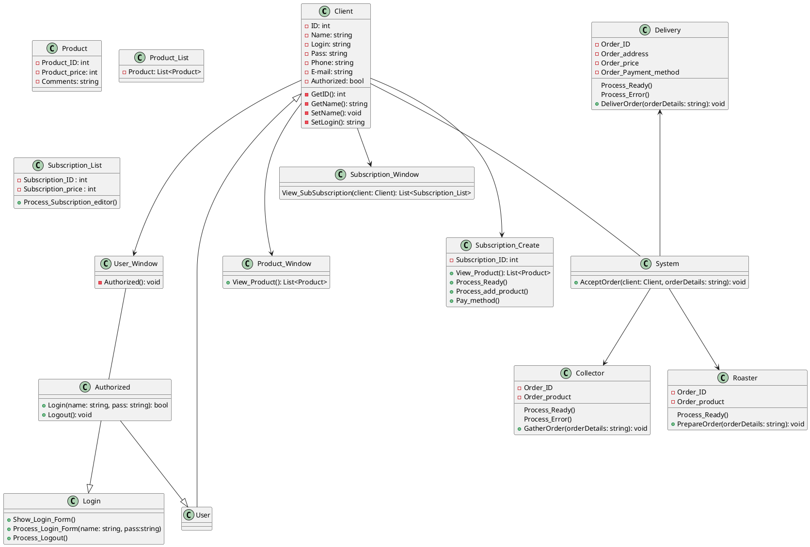

Dia

```plantuml
@startuml


Client : -ID: int
Client : -Name: string
Client : -Login: string
Client : -Pass: string
Client : -Phone: string
Client : -E-mail: string
Client : -Authorized: bool
Client : -GetID(): int
Client : -GetName(): string
Client : -SetName(): void
Client : -SetLogin(): string

Client ---> User_Window 
User_Window : -Authorized(): void

User_Window --- Authorized 
Authorized  : +Login(name: string, pass: string): bool
Authorized  : +Logout(): void

Authorized ---|> Login
Login : +Show_Login_Form()
Login : +Process_Login_Form(name: string, pass:string)
Login : +Process_Logout()

Authorized ---|> User

User ---|> Client

Client ---> Product_Window
Product_Window : +View_Product(): List<Product>


Product : -Product_ID: int
Product : -Product_price: int
Product : -Comments: string

Product_List : -Product: List<Product>

Client --> Subscription_Window
Subscription_Window : View_SubSubscription(client: Client): List<Subscription_List>
Subscription_List : -Subscription_ID : int
Subscription_List : -Subscription_price : int
Subscription_List : +Process_Subscription_editor()

Subscription_Create  : +View_Product(): List<Product>
Subscription_Create  : +Process_Ready()
Subscription_Create  : -Subscription_ID: int
Subscription_Create  : +Process_add_product()
Subscription_Create  : +Pay_method()

Client ---> Subscription_Create

class System {
    +AcceptOrder(client: Client, orderDetails: string): void
}

Delivery <--- System
Client --- System

Delivery : -Order_ID
Delivery : -Order_address
Delivery : -Order_price
Delivery : -Order_Payment_method
Delivery : Process_Ready()
Delivery : Process_Error()
Delivery : +DeliverOrder(orderDetails: string): void

System ---> Collector
Collector : -Order_ID
Collector : -Order_product
Collector : Process_Ready()
Collector : Process_Error()
Collector : +GatherOrder(orderDetails: string): void

System ---> Roaster
Roaster : -Order_ID
Roaster : -Order_product
Roaster : Process_Ready()
Roaster : +PrepareOrder(orderDetails: string): void

@enduml
```
