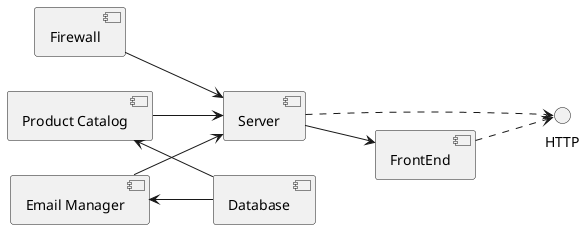

# !!!!!

1-

```plantuml
@startuml
left to right direction
[Firewall] --> [Server]
[Email Manager] --> [Server]
[Email Manager] <-- [Database]
[Product Catalog] --> [Server]
[Server] --> [FrontEnd]
[Product Catalog] <-- [Database]

[FrontEnd] ..> HTTP
[Server] ..> HTTP
@enduml
```